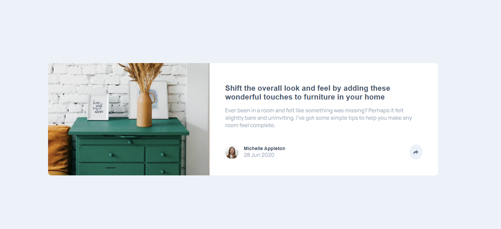

# Frontend Mentor - Article preview component solution

This is a solution to the [Article preview component challenge on Frontend Mentor](https://www.frontendmentor.io/challenges/article-preview-component-dYBN_pYFT). Frontend Mentor challenges help you improve your coding skills by building realistic projects. 

## Table of contents

- [Overview](#overview)
  - [The challenge](#the-challenge)
  - [Screenshot](#screenshot)
  - [Links](#links)
- [My process](#my-process)
  - [Built with](#built-with)
  - [What I learned](#what-i-learned)
  - [Continued development](#continued-development)
- [Author](#author)

## Overview

### The challenge

Users should be able to:

- View the optimal layout for the component depending on their device's screen size
- See the social media share links when they click the share icon

### Screenshot

### Links

- Solution URL: [https://www.frontendmentor.io/solutions/article-preview-component-using-vanilla-js-Ah98W1TS-i](https://www.frontendmentor.io/solutions/article-preview-component-using-vanilla-js-Ah98W1TS-i)
- Live Site URL: [https://edoardozampini.github.io/article-preview-component/](https://edoardozampini.github.io/article-preview-component/)

## My process

### Built with

- Semantic HTML5 markup
- CSS custom properties
- Flexbox
- Responsive design
- Vanilla JavaScript (DOM manipulation)

### What I learned

While building this project, I improved my understanding of responsive layouts and handling UI interactions using vanilla JavaScript. I learned how to toggle elements dynamically using CSS classes, and how to adapt different UI behaviors based on screen size (desktop vs mobile).

I also learned the importance of proper HTML semantics and avoiding duplicated IDs by using reusable classes instead.

Here is a JavaScript snippet I’m proud of, used for toggling the sharing box on desktop:

const socialButton = document.getElementById('icon-container');
const shareBox = document.getElementById('share-box');

socialButton.addEventListener('click', function() {
    shareBox.classList.toggle('is-visible');
    socialButton.classList.toggle('active');
});

This project helped me reinforce the concept of event handling, state toggling, and writing cleaner CSS by separating style logic into reusable classes instead of inline styling.

### Continued development

In future projects, I want to continue focusing on:

- Enhancing accessibility (keyboard navigation, ARIA attributes, focus states)
- Writing more modular and scalable JavaScript
- Improving CSS architecture (BEM, utility classes, component-based styling)
- Dynamically positioning UI elements without relying on fixed values (e.g., tooltips and share popups)

## Author

- Website: [Schima](https://schima.it/)
- Frontend Mentor: https://www.frontendmentor.io/profile/edoardozampini
- GitHub: https://github.com/edoardozampini